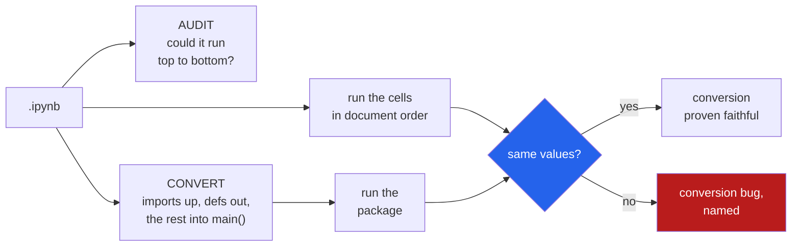

<h1 align="center">notebook-to-package (Python · AST · differential execution · zero deps)</h1>
<p align="center"><i>A notebook is a transcript of a session, not a program. This turns one into a package and proves it still does the same thing.</i></p>

<p align="center">
  <a href="#the-through-line">The through-line</a> &middot;
  <a href="#the-result">The result</a> &middot;
  <a href="docs/RESULTS.md">Full results</a> &middot;
  <a href="#how-it-works">How it works</a> &middot;
  <a href="#run-it">Run it</a> &middot;
  <a href="#what-this-does-not-do">What it does NOT do</a> &middot;
  <a href="#problems-hit-while-building-this">Problems hit</a>
</p>

<p align="center">
  <a href="https://github.com/hammasbuilds/notebook-to-package/actions/workflows/ci.yml"></a>
  
  
  
  
  <a href="LICENSE"></a>
</p>

---

## The through-line



The cells are stored in the order they are **printed**, not the order they were **run**.
A name can be read in cell 3 and assigned in cell 9. A name can come from a cell that has
since been deleted, in which case nobody will ever run the file from clean again.

So the conversion is the easy half. The half that matters is proving it did not change
anything — and it is easy to break, because moving a top-level statement into a function
turns a module global into a local:

```python
df = load()                  # cell 2
def summarise():             # cell 5
    return df.describe()     # reads the global `df`
```

Move `df = load()` into `main()` without a `global` and the module still imports cleanly.
`summarise()` raises `NameError` the first time anybody calls it. **Nothing short of running
both sides finds that**, so both sides are run and their resulting values compared.

## The result

Two corpora, because the first one flattered everybody. **books** are notebooks published as
books and courses, proofread to be read in order. **wild** are notebooks from ten ordinary
repositories, written to get work done.

### Can they be run from clean?

| | books (291) | wild (106) |
|---|---:|---:|
| **provably run top to bottom in a fresh kernel** | **89%** | **66%** |
| use a name that is defined in no cell at all | 10% | **33%** |
| use a name before the cell that defines it | 1% | 9% |
| contain a cell that is not valid Python | 16% | 26% |
| contain a cell that was never run | 1% | **69%** |
| star-import, so the question is undecidable | 3% | 22% |
| most common magic | `%matplotlib` (169) | **`!shell` (318)** |

**One notebook in three from an ordinary repository uses a name that exists in no cell.** It
came from a cell that has since been deleted. Nobody can run that file from clean — not the
author, not next year, not you.

"Provably" is not hedging. A star-import binds names static analysis cannot see, so those
notebooks are counted in neither direction and 66% is a floor.

### Does the conversion preserve behaviour?

Convert, run the notebook, run the generated package, compare every value each left behind:

```
291 notebooks attempted
    204  the notebook itself did not run here - excluded, nothing can be concluded
     87  both sides ran, so the conversion can be judged
     87  faithful (100.0%)
      0  broken

  22 notebooks produced 80 values that differ between two runs of the notebook ITSELF
  (excluded - the conversion cannot be blamed for a value the notebook does not reproduce)
```

**That second block is the whole reason the number is trustworthy.** Before the control run
existed, this benchmark reported four conversion failures. All four were notebooks using
unseeded `np.random`: the values differed because the notebook differs from itself, and the
conversion had nothing to do with it. Four accusations out of four, every one false.

The denominator is honest and it is brutal: 204 of 291 notebooks could not run here at all,
mostly `ModuleNotFoundError`. On the wild corpus it is worse — 102 of 106, leaving **4**
decidable, which is a sample too small to quote and is reported as such.

See [docs/RESULTS.md](docs/RESULTS.md).

## How it works

**No nbformat, no jupyter_client.** A `.ipynb` is JSON and its cells are Python, so `json`
and `ast` are the whole toolchain. That is why this has no runtime dependencies at all.

**Magics are removed and listed, never translated.** `%matplotlib inline` has no equivalent
and `!pip install` is not this tool's business. The critical part is that a cell containing a
magic is still *parsed* — strip the magic lines first, then parse what is left.

**A function body is not evaluated at definition time.** A helper defined in cell 2 that
reads a constant set in cell 5 is correct, ordinary notebook style. Free names inside a
function are checked for *existing*, not for ordering. A class body is checked for both,
because a class body does run immediately.

**`main()` declares `global` for exactly the names it binds that a module-level definition
reads.** No more: a blanket `global` would export every loop variable as package surface.

**Values are compared as normalised digests, not with `==`.** A DataFrame `==` a DataFrame
returns a frame, and `bool()` of it raises. Each value becomes a type name plus a `repr`
with memory addresses and the module qualifier stripped. Anything whose repr raises is
counted as opaque and excluded from **both** sides, because a comparison that always fails
is not evidence either way.

**Both sides run in a subprocess, optionally under a different interpreter.** The notebook
needs pandas and matplotlib; this tool needs nothing.

## Run it

```bash
git clone https://github.com/hammasbuilds/notebook-to-package
cd notebook-to-package
uv venv && uv pip install -e ".[dev]"

ntp audit analysis.ipynb            # could it run top to bottom? exits 1 if not
ntp convert analysis.ipynb ./pkg    # write an installable package
ntp verify analysis.ipynb --python /path/to/env/bin/python   # run both, compare

ntp survey ~/notebooks              # audit a whole directory
ntp bench  ~/notebooks --python ...  # convert and verify every one of them
```

`ntp audit` exits non-zero when a notebook cannot run from clean, which makes it a
pre-commit hook. `ntp verify` exits non-zero **only** when the conversion is shown to be
wrong — a notebook that fails on its own proves nothing and must not fail a build.

## Layout

```
src/notebook_to_package/
  notebook.py  read the JSON; tell IPython magics from Python
  audit.py     could it run top to bottom - and the false positives that question invites
  convert.py   the rearranging, and the scoping it breaks if done naively
  package.py   pyproject, entry point, dependencies declared but never invented
  verify.py    run both sides, compare what each left behind
  survey.py    audit a corpus and count what is wrong with it
  bench.py     convert and verify a corpus, with an honest denominator
```

## What this does NOT do

- **It cannot judge a notebook it cannot run.** 204 of 291 were excluded, and on ordinary
  repositories 102 of 106. The static audit is the part that works on those.
- **Values are compared by digest, not by equality.** A DataFrame `==` a DataFrame returns a
  frame, and `bool()` of it raises. Two different objects with the same `repr` compare equal
  here. That is weaker than equality, in a stated direction.
- **Magics are removed, never translated.** `%matplotlib inline` is harmless to lose;
  `!pip install` and `%run other.ipynb` are not, and the report lists everything it dropped.
- **Cells are never reordered.** A notebook whose names are used before they are defined does
  not run top to bottom, and quietly sorting the cells would produce a package that works
  while the notebook does not — hiding the defect instead of reporting it.
- **Nothing is deleted as dead.** A cell binding a name nobody reads may still be the point
  of the notebook: it wrote a file, trained a model, printed the answer.
- **Dependencies are declared, never pinned.** The notebook records which packages it imports
  and not which versions it ran against. Writing `pandas>=2` would be an invention.
- **The static audit is syntactic.** A name bound by `exec`, by `globals()[...]`, or by a
  star-import is invisible and would be reported as undefined — so star-imports are detected
  and the notebook is excused rather than accused.
- **Both corpora are convenience samples.** Four published books and ten repositories from
  one GitHub search. The books/wild gap is large enough to be worth reporting; its exact size
  is not.

## Problems hit while building this

- **Four conversion failures that were not.** Every one was a notebook calling `np.random`
  with no seed, so its values differ between any two runs of itself. The fix is a control
  run — execute the notebook twice and discard every name that differs from itself — which
  costs a third execution and is the difference between a measurement and an accusation.
- **`%matplotlib inline` made the whole cell unparseable**, and that cell is usually the one
  holding the imports. Every module it imported then read as *never defined*. On a corpus
  that turns the headline number into noise. Magic lines are stripped before parsing.
- **A function reading a global defined in a later cell was flagged as broken.** It is not:
  a function body is not evaluated until it is called, and "helper early, config later" is
  ordinary notebook style. Free names inside functions are checked for *existing*, not for
  ordering — while a class body, which does run immediately, is checked for both.
- **The fidelity check compared against the wrong dictionary.** `runpy.run_path` returns a
  copy of the globals taken when the module finished executing — *before* `main()` is called
  — so every value the conversion computed landed in the real module and none in that copy.
  It reported every notebook as unfaithful, with every name "only in the notebook".
- **One notebook hung a corpus run for 25 minutes on a 45-second timeout.** matplotlib's
  default backend opens a window and `plt.show()` blocks forever; killing the interpreter
  does not help, because the GUI thread holds the output pipe open and the parent waits in
  `communicate()` for an EOF that never comes. Fixed with `MPLBACKEND=Agg`,
  `stdin=DEVNULL`, and a process-tree kill.
- **A corpus fetch downloaded 151 files and deleted every one.** The validation step called
  Windows Python with an MSYS path (`/c/Users/...`), which it resolves as a Windows path that
  does not exist — so validation failed for each file and the retry loop removed a download
  that was fine.

## Also worth reading

| | |
|---|---|
| &#128202; **[Results](docs/RESULTS.md)** | Both corpora in full, with the exclusions |
| **[cartographer](https://github.com/hammasbuilds/cartographer)** | What a repo's imports claim, against what its history shows |
| **[flake-detective](https://github.com/hammasbuilds/flake-detective)** | Which variable a flaky test actually depends on |
| **[blast-radius](https://github.com/hammasbuilds/blast-radius)** | What a dependency upgrade actually changes |
| **[pr-referee](https://github.com/hammasbuilds/pr-referee)** | Whether a diff changes behaviour, by running both sides |

## Keywords

jupyter &middot; notebook &middot; ipynb &middot; hidden state &middot; reproducibility
&middot; refactoring &middot; packaging &middot; AST &middot; differential testing &middot;
out-of-order execution &middot; nbconvert alternative &middot; research software

## License

MIT - see [LICENSE](LICENSE).
